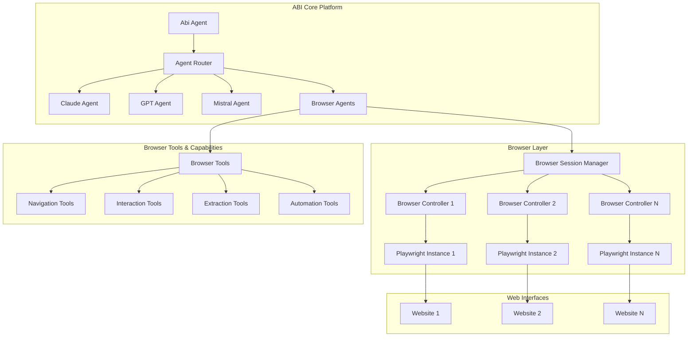

# Browser-Use Architecture Design

## System Architecture Overview

This document defines the technical architecture for integrating browser-use into ABI, ensuring seamless browser automation capabilities while maintaining the existing agent orchestration framework.

## High-Level Architecture



## Component Architecture

### 1. Browser-Enhanced Agent Framework

#### Base Browser Agent
```python
from abc import ABC, abstractmethod
from browser_use import Agent as BrowserUseAgent
from abi.services.agent.IntentAgent import IntentAgent

class BrowserAgent(IntentAgent, ABC):
    """Enhanced ABI agent with browser automation capabilities"""
    
    def __init__(self, browser_config: BrowserConfig = None):
        super().__init__()
        self.browser_config = browser_config or BrowserConfig.default()
        self.browser_session: Optional[BrowserSession] = None
        self.browser_tools = BrowserToolkit()
        
    async def initialize_browser(self) -> BrowserSession:
        """Initialize browser session for the agent"""
        
    async def cleanup_browser(self) -> None:
        """Clean up browser resources"""
        
    @abstractmethod
    async def process_browser_task(self, task: BrowserTask) -> BrowserResult:
        """Process browser automation tasks"""
```

#### Browser Session Management
```python
class BrowserSessionManager:
    """Centralized management of browser sessions"""
    
    def __init__(self):
        self._sessions: Dict[str, BrowserSession] = {}
        self._session_pool = BrowserSessionPool()
        self._cleanup_scheduler = CleanupScheduler()
    
    async def get_or_create_session(
        self, 
        agent_id: str, 
        config: BrowserConfig
    ) -> BrowserSession:
        """Get existing session or create new one"""
        
    async def release_session(self, agent_id: str) -> None:
        """Release session back to pool"""
        
    async def cleanup_expired_sessions(self) -> None:
        """Clean up expired or unused sessions"""

class BrowserSession:
    """Represents an active browser session"""
    
    def __init__(self, session_id: str, config: BrowserConfig):
        self.session_id = session_id
        self.config = config
        self.browser_agent: Optional[BrowserUseAgent] = None
        self.created_at = datetime.utcnow()
        self.last_used = datetime.utcnow()
        self.is_active = False
    
    async def start(self) -> None:
        """Start the browser session"""
        
    async def stop(self) -> None:
        """Stop the browser session"""
        
    async def execute_task(self, task: str) -> BrowserResult:
        """Execute a browser automation task"""
```

### 2. Browser Tools Integration

#### Tool Categories
```python
class NavigationTools:
    """Tools for browser navigation"""
    
    @tool
    async def navigate_to_url(self, url: str) -> NavigationResult:
        """Navigate to a specific URL"""
        
    @tool
    async def go_back(self) -> NavigationResult:
        """Navigate back in browser history"""
        
    @tool
    async def go_forward(self) -> NavigationResult:
        """Navigate forward in browser history"""
        
    @tool
    async def refresh_page(self) -> NavigationResult:
        """Refresh the current page"""

class InteractionTools:
    """Tools for web page interaction"""
    
    @tool
    async def click_element(self, selector: str) -> InteractionResult:
        """Click on a web element"""
        
    @tool
    async def type_text(self, selector: str, text: str) -> InteractionResult:
        """Type text into an input field"""
        
    @tool
    async def select_option(self, selector: str, option: str) -> InteractionResult:
        """Select an option from a dropdown"""
        
    @tool
    async def upload_file(self, selector: str, file_path: str) -> InteractionResult:
        """Upload a file through a file input"""

class ExtractionTools:
    """Tools for data extraction"""
    
    @tool
    async def extract_text(self, selector: str) -> ExtractionResult:
        """Extract text content from elements"""
        
    @tool
    async def extract_table_data(self, table_selector: str) -> ExtractionResult:
        """Extract structured data from tables"""
        
    @tool
    async def extract_form_data(self, form_selector: str) -> ExtractionResult:
        """Extract form field information"""
        
    @tool
    async def take_screenshot(self, options: ScreenshotOptions = None) -> ExtractionResult:
        """Take a screenshot of the current page"""

class AutomationTools:
    """Advanced automation tools"""
    
    @tool
    async def wait_for_element(self, selector: str, timeout: int = 5000) -> AutomationResult:
        """Wait for an element to appear"""
        
    @tool
    async def scroll_to_element(self, selector: str) -> AutomationResult:
        """Scroll to bring element into view"""
        
    @tool
    async def handle_dialog(self, action: str, text: str = None) -> AutomationResult:
        """Handle browser dialogs (alert, confirm, prompt)"""
```

### 3. Configuration Management

#### Browser Configuration
```python
@dataclass
class BrowserConfig:
    """Configuration for browser sessions"""
    
    # Browser Settings
    browser_type: str = "chromium"  # chromium, firefox, webkit
    headless: bool = True
    viewport_width: int = 1920
    viewport_height: int = 1080
    
    # Performance Settings
    timeout: int = 30000  # 30 seconds
    wait_for_load_state: str = "networkidle"
    
    # Security Settings
    ignore_https_errors: bool = False
    bypass_csp: bool = False
    
    # Network Settings
    proxy: Optional[ProxyConfig] = None
    user_agent: Optional[str] = None
    
    # Resource Management
    max_concurrent_sessions: int = 5
    session_timeout: int = 300  # 5 minutes
    auto_cleanup: bool = True
    
    @classmethod
    def default(cls) -> 'BrowserConfig':
        """Default browser configuration"""
        return cls()
    
    @classmethod
    def headful_debug(cls) -> 'BrowserConfig':
        """Configuration for debugging with visible browser"""
        return cls(headless=False, timeout=60000)
    
    @classmethod
    def enterprise(cls) -> 'BrowserConfig':
        """Enterprise-grade configuration"""
        return cls(
            ignore_https_errors=False,
            bypass_csp=False,
            max_concurrent_sessions=10,
            session_timeout=600
        )
```

### 4. Agent Integration Patterns

#### Extended Existing Agents
```python
class ChatGPTBrowserAgent(ChatGPTAgent, BrowserAgent):
    """ChatGPT agent with browser capabilities"""
    
    def __init__(self):
        ChatGPTAgent.__init__(self)
        BrowserAgent.__init__(self)
        
        # Merge tools from both parent classes
        self.tools.extend(self.browser_tools.get_all_tools())
        
        # Update system prompt to include browser capabilities
        self.configuration.system_prompt = self._merge_system_prompts()
    
    def _merge_system_prompts(self) -> str:
        """Combine ChatGPT and browser capabilities in system prompt"""
        base_prompt = super().configuration.system_prompt
        browser_prompt = """
        
        BROWSER AUTOMATION CAPABILITIES:
        You can now interact with web browsers to:
        - Navigate to websites and web applications
        - Click buttons, fill forms, and interact with web elements
        - Extract data from web pages and tables
        - Take screenshots and capture page content
        - Handle complex multi-step web workflows
        
        Use these capabilities when users request web-based tasks such as:
        - Research and data gathering from websites
        - Form filling and submission
        - E-commerce operations (browsing, adding to cart, etc.)
        - Social media interactions
        - Web application testing and automation
        """
        return base_prompt + browser_prompt

class WebAutomationAgent(BrowserAgent):
    """Specialized agent for web automation tasks"""
    
    NAME = "WebAutomation"
    DESCRIPTION = "Specialized AI agent for browser automation and web task execution"
    
    SYSTEM_PROMPT = """
    You are a web automation specialist powered by browser automation capabilities.
    
    Your expertise includes:
    - Web scraping and data extraction
    - Form automation and submission
    - E-commerce automation (product research, price comparison, order management)
    - Social media automation (content posting, engagement tracking)
    - Web application testing and QA
    - Business process automation involving web interfaces
    
    You can see and interact with web pages like a human user, but with perfect
    accuracy and consistency. Always consider user privacy, website terms of service,
    and rate limiting when performing automation tasks.
    
    When approaching web automation tasks:
    1. Analyze the website structure and requirements
    2. Plan the automation steps efficiently
    3. Handle errors gracefully with appropriate fallbacks
    4. Provide clear status updates on task progress
    5. Respect robots.txt and implement appropriate delays
    """
```

### 5. Error Handling and Recovery

#### Browser Error Management
```python
class BrowserErrorHandler:
    """Centralized error handling for browser operations"""
    
    def __init__(self):
        self.retry_strategies = {
            'network_timeout': NetworkTimeoutStrategy(),
            'element_not_found': ElementNotFoundStrategy(),
            'session_lost': SessionLostStrategy(),
            'page_crash': PageCrashStrategy()
        }
    
    async def handle_error(
        self, 
        error: BrowserError, 
        context: BrowserContext
    ) -> RecoveryResult:
        """Handle browser automation errors with appropriate recovery"""
        
        strategy = self.retry_strategies.get(error.type)
        if strategy:
            return await strategy.recover(error, context)
        
        return RecoveryResult.failed(f"No recovery strategy for {error.type}")

class RecoveryStrategy(ABC):
    """Base class for error recovery strategies"""
    
    @abstractmethod
    async def recover(
        self, 
        error: BrowserError, 
        context: BrowserContext
    ) -> RecoveryResult:
        """Attempt to recover from the error"""

class NetworkTimeoutStrategy(RecoveryStrategy):
    """Recovery strategy for network timeouts"""
    
    async def recover(
        self, 
        error: BrowserError, 
        context: BrowserContext
    ) -> RecoveryResult:
        # Implement retry with exponential backoff
        # Check network connectivity
        # Possibly switch to backup proxy
        pass

class ElementNotFoundStrategy(RecoveryStrategy):
    """Recovery strategy for missing elements"""
    
    async def recover(
        self, 
        error: BrowserError, 
        context: BrowserContext
    ) -> RecoveryResult:
        # Wait for dynamic content to load
        # Try alternative selectors
        # Take screenshot for debugging
        pass
```

### 6. Performance Optimization

#### Session Pooling
```python
class BrowserSessionPool:
    """Pool of reusable browser sessions"""
    
    def __init__(self, max_size: int = 10):
        self.max_size = max_size
        self._available_sessions: Queue[BrowserSession] = Queue()
        self._active_sessions: Dict[str, BrowserSession] = {}
        self._session_lock = asyncio.Lock()
    
    async def acquire_session(self, config: BrowserConfig) -> BrowserSession:
        """Acquire a session from the pool"""
        
    async def release_session(self, session: BrowserSession) -> None:
        """Return session to the pool"""
        
    async def cleanup_pool(self) -> None:
        """Clean up unused sessions"""

class BrowserResourceMonitor:
    """Monitor browser resource usage"""
    
    def __init__(self):
        self.memory_threshold = 1024 * 1024 * 1024  # 1GB
        self.cpu_threshold = 80  # 80%
        
    async def monitor_resources(self) -> ResourceMetrics:
        """Monitor current resource usage"""
        
    async def trigger_cleanup_if_needed(self) -> None:
        """Clean up resources if thresholds exceeded"""
```

### 7. Security Architecture

#### Secure Browser Sessions
```python
class SecureBrowserSession(BrowserSession):
    """Browser session with enhanced security features"""
    
    def __init__(self, session_id: str, config: SecureBrowserConfig):
        super().__init__(session_id, config)
        self.credential_manager = CredentialManager()
        self.network_interceptor = NetworkInterceptor()
        
    async def start(self) -> None:
        """Start session with security enhancements"""
        await super().start()
        await self._setup_security_features()
        
    async def _setup_security_features(self) -> None:
        """Configure security features for the browser session"""
        # Set up network interception for credential protection
        # Configure content security policies
        # Enable secure cookie handling
        # Set up request/response logging for audit
```

## Data Flow Architecture

### 1. Request Processing Flow
```
User Request → Abi Agent → Agent Router → Browser Agent → Browser Session Manager → Browser Controller → Playwright → Website
```

### 2. Response Flow
```
Website → Playwright → Browser Controller → Browser Session Manager → Browser Agent → Agent Router → Abi Agent → User Response
```

### 3. Error Handling Flow
```
Browser Error → Error Handler → Recovery Strategy → Retry/Fallback → Continue/Report Failure
```

## Scalability Considerations

### Horizontal Scaling
- Multiple browser agent instances
- Load balancing across browser sessions
- Distributed session management

### Vertical Scaling
- Resource-efficient browser configurations
- Session pooling and reuse
- Memory and CPU optimization

### Cloud Deployment
- Container-based browser instances
- Auto-scaling based on demand
- Distributed session storage

## Integration Points

### With Existing ABI Components
1. **Agent Framework**: Seamless integration with existing agent architecture
2. **Intent System**: Browser-specific intent recognition and routing
3. **Tool System**: Browser tools integrated into existing tool framework
4. **Configuration**: Browser settings integrated into ABI configuration
5. **Logging**: Browser activities logged through existing logging system

### With External Systems
1. **Playwright**: Core browser automation engine
2. **Browser-Use**: High-level browser automation library
3. **MCP Servers**: Integration with Model Context Protocol
4. **Monitoring Systems**: Resource monitoring and alerting
5. **Security Systems**: Integration with enterprise security frameworks

## Conclusion

This architecture design ensures that browser-use integration enhances ABI's capabilities while maintaining its core strengths of modularity, scalability, and security. The design supports both simple browser automation tasks and complex multi-agent web workflows, positioning ABI as a comprehensive platform for intelligent automation.