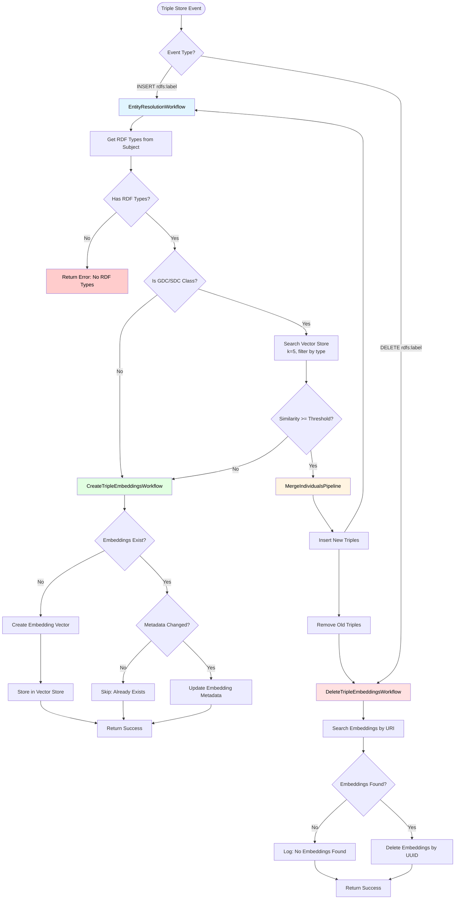

# Triplestore Embeddings Module

This module provides automatic entity resolution and embedding management for RDF triples in a triple store. It automatically creates, updates, and deletes embeddings when triples are inserted or removed from the ontology.

## Module Initialization Logic (`__init__.py`)

The module initialization (`on_load` method) performs the following steps:

1. **Configuration Setup**: Reads module configuration including:
   - `datastore_path`: Path for storing merged individual data
   - `collection_name`: Vector store collection name for embeddings
   - `embeddings_dimensions`: Dimension of embedding vectors
   - `embeddings_model_name`: Name of the embeddings model
   - `embeddings_model_provider`: Provider of the embeddings model (currently supports "openai")

2. **Embeddings Model Initialization**: Creates an embeddings model instance (e.g., `OpenAIEmbeddings`) based on the configuration.

3. **Workflow and Pipeline Configuration**: Initializes configurations for:
   - `CreateTripleEmbeddingsWorkflow`: Creates embeddings for new triples
   - `MergeIndividualsPipeline`: Merges duplicate entities
   - `EntityResolutionWorkflow`: Resolves entity duplicates using embeddings
   - `DeleteTripleEmbeddingsWorkflow`: Removes embeddings when triples are deleted

4. **Event Subscriptions**: Subscribes to triple store events:
   - **INSERT events** (`OntologyEvent.INSERT`): When a new `(subject, rdfs:label, object)` triple is inserted, triggers `EntityResolutionWorkflow.resolve_entity()`
   - **DELETE events** (`OntologyEvent.DELETE`): When a `(subject, rdfs:label, object)` triple is deleted, triggers `DeleteTripleEmbeddingsWorkflow.delete_triple_embeddings()`

## Workflow and Pipeline Relationships

### Entity Resolution Workflow

The `EntityResolutionWorkflow` is the main entry point for handling new entity labels. It implements intelligent duplicate detection:

1. **Entity Type Detection**: Checks if the entity belongs to GDC (Generically Dependent Continuant) or SDC (Specifically Dependent Continuant) classes by checking if any of its RDF types are subclasses of:
   - `http://purl.obolibrary.org/obo/BFO_0000031` (BFO_0000031)
   - `http://purl.obolibrary.org/obo/BFO_0000020` (BFO_0000020)

2. **Similarity Search**: If the entity is a GDC/SDC class:
   - Creates an embedding vector from the label
   - Searches the vector store for similar entities (k=5) with matching OWL types
   - Filters results by `similarity_threshold` (default: 0.98, range: 0.95-1.0)

3. **Merge Decision**: If a similar entity is found above the threshold:
   - Calls `MergeIndividualsPipeline` to merge the duplicate entity
   - The existing entity (from search results) is kept, and the new entity is merged into it

4. **Create Embeddings**: If no similar entity is found:
   - Calls `CreateTripleEmbeddingsWorkflow` to create and store embeddings for the new entity

### Create Triple Embeddings Workflow

The `CreateTripleEmbeddingsWorkflow` handles the creation and storage of embeddings:

1. **Metadata Collection**: Extracts RDF types from the subject and adds them to metadata
2. **Collection Management**: Ensures the vector store collection exists
3. **Embedding Creation**: 
   - Generates a UUID from the subject URI
   - Creates an embedding vector from the label
   - Checks if embeddings already exist for this UUID
4. **Storage Logic**:
   - If no embeddings exist: Creates new embeddings with metadata
   - If embeddings exist but metadata changed: Updates the existing embeddings
   - If embeddings exist and metadata unchanged: Skips (idempotent)

### Delete Triple Embeddings Workflow

The `DeleteTripleEmbeddingsWorkflow` handles cleanup when triples are removed:

1. **UUID Generation**: Creates a UUID from the subject URI
2. **Search and Delete**: 
   - Searches for embeddings matching the URI
   - Deletes the embeddings using the UUID as document ID
3. **Idempotent**: If no embeddings are found, the operation completes successfully

### Merge Individuals Pipeline

The `MergeIndividualsPipeline` performs ontology-level entity merging:

1. **Triple Collection**: Retrieves all triples where each URI appears as subject or object
2. **Merge Logic**:
   - Transfers all triples from `uri_to_merge` to `uri_to_keep`
   - Handles special cases:
     - `rdfs:label` values (except "unknown") are converted to `skos:altLabel` on the kept entity
     - Prevents duplicate properties
   - Updates object references: triples pointing to `uri_to_merge` are updated to point to `uri_to_keep`
3. **Storage**: 
   - Saves merged triples to object storage
   - Inserts new triples into triple store
   - Removes old triples from triple store

## Workflow Diagram



## Logical Relationships

### Workflow Hierarchy

1. **EntityResolutionWorkflow** (Orchestrator)
   - **Uses**: `MergeIndividualsPipeline` (when duplicates found)
   - **Uses**: `CreateTripleEmbeddingsWorkflow` (when no duplicates found)
   - **Purpose**: Intelligent entity deduplication

2. **CreateTripleEmbeddingsWorkflow** (Standalone)
   - **Purpose**: Create and manage embeddings for entities
   - **Called by**: `EntityResolutionWorkflow` when no duplicates are detected

3. **DeleteTripleEmbeddingsWorkflow** (Standalone)
   - **Purpose**: Clean up embeddings when entities are removed
   - **Triggered by**: DELETE events from triple store

4. **MergeIndividualsPipeline** (Service)
   - **Purpose**: Merge duplicate entities at the ontology level
   - **Called by**: `EntityResolutionWorkflow` when duplicates are detected

### Data Flow

```
Triple Store INSERT Event
    ↓
EntityResolutionWorkflow
    ↓
    ├─→ [GDC/SDC Class?] → Yes → Vector Store Search
    │                              ↓
    │                         [Similar Found?] → Yes → MergeIndividualsPipeline
    │                              ↓                    ↓
    │                              No              Update Triple Store
    │                              ↓                    ↓
    │                         CreateTripleEmbeddingsWorkflow
    │                              ↓
    │                         Update Vector Store
    │
    └─→ [GDC/SDC Class?] → No → CreateTripleEmbeddingsWorkflow
                                      ↓
                                 Update Vector Store

Triple Store DELETE Event
    ↓
DeleteTripleEmbeddingsWorkflow
    ↓
Remove from Vector Store
```

### Key Design Patterns

1. **Event-Driven Architecture**: Workflows are triggered by triple store events, ensuring automatic synchronization
2. **Idempotency**: All workflows handle existing data gracefully (create/update/delete operations are safe to repeat)
3. **Separation of Concerns**: 
   - Workflows handle business logic and orchestration
   - Pipelines handle complex data transformations
   - Utils provide reusable helper functions
4. **Metadata-Driven**: Embeddings include rich metadata (URI, label, RDF types, OWL types) for filtering and search
5. **Similarity-Based Deduplication**: Uses vector similarity search to identify potential duplicates before merging

## Configuration Example

```yaml
module: naas_abi_core.modules.triplestore_embeddings
enabled: true
config:
    datastore_path: "triples"
    collection_name: "triple_embeddings"
    embeddings_dimensions: 3072
    embeddings_model_name: "text-embedding-3-large"
    embeddings_model_provider: "openai"
```

## Dependencies

- **Modules**: `naas_abi_marketplace.ai.chatgpt` (soft dependency)
- **Services**: 
  - `TripleStoreService`: For ontology operations
  - `VectorStoreService`: For embedding storage and search
  - `ObjectStorageService`: For saving merged individual data
