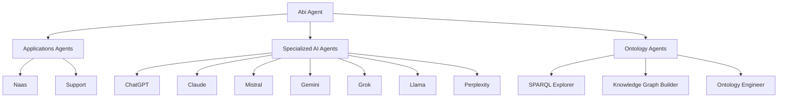

# Abi Agent Module

> **Multi-Agent Orchestrator and Knowledge Graph Management System**

The Abi module is the **central coordination hub** for the ABI ecosystem, featuring a sophisticated multi-agent orchestrator, specialized knowledge graph agents, and comprehensive ontology management capabilities.

## 🎯 Purpose & Role

**Abi** (*Agentic Brain Infrastructure*) provides comprehensive AI orchestration and knowledge management through:

- **Multi-Agent Orchestration**: Central coordinator managing specialized AI agents (ChatGPT, Claude, Mistral, Gemini, Grok, Llama, Perplexity, Qwen, DeepSeek, Gemma)
- **Knowledge Graph Operations**: Complete CRUD operations for semantic data management
- **Ontology Engineering**: BFO-compliant entity extraction and SPARQL generation
- **Intelligent Routing**: Weighted decision hierarchy with context preservation
- **Multilingual Support**: Native French/English interactions with cultural awareness
- **Production Integration**: Event-driven triggers and YAML ontology publishing

## 🏗️ Architecture

### Directory Structure
```
src/core/abi/
├── agents/                  # Agent implementations
│   ├── AbiAgent.py         # Main multi-agent orchestrator
│   ├── AbiAgent_test.py    # Comprehensive test suite
│   ├── EntitytoSPARQLAgent.py        # BFO entity extraction & SPARQL generation
│   ├── EntitytoSPARQLAgent_test.py   # Entity extraction tests
│   ├── KnowledgeGraphBuilderAgent.py # Triple store CRUD operations
│   ├── KnowledgeGraphBuilderAgent_test.py # KG builder tests
│   ├── OntologyEngineerAgent.py      # BFO ontology engineering
│   └── OntologyEngineerAgent_test.py # Ontology engineering tests
├── apps/                    # User interface applications
│   ├── avatar_chat/        # Avatar-based chat interface
│   ├── oxigraph_admin/     # Knowledge graph administration
│   ├── sparql_terminal/    # SPARQL query interface
│   └── terminal_agent/     # Main terminal chat interface
├── models/                  # Model configurations
│   ├── default.py          # Model selection (airgap/cloud mode)
│   ├── airgap_qwen.py      # Qwen3 airgap model (temp=0.7)
│   └── airgap_gemma.py     # Gemma3 airgap model (temp=0.2)
├── workflows/               # Business logic workflows (9 implementations)
│   ├── AgentRecommendationWorkflow.py     # AI agent recommendation engine
│   ├── ArtificialAnalysisWorkflow.py      # AI model analysis
│   ├── ConvertOntologyGraphToYamlWorkflow.py # Graph to YAML conversion
│   ├── CreateClassOntologyYamlWorkflow.py    # Class ontology publishing
│   ├── CreateIndividualOntologyYamlWorkflow.py # Individual ontology publishing
│   ├── ExportGraphInstancesToExcelWorkflow.py # Data export capabilities
│   ├── GetObjectPropertiesFromClassWorkflow.py # Property retrieval
│   ├── GetSubjectGraphWorkflow.py            # Entity graph exploration
│   └── SearchIndividualWorkflow.py           # Semantic search
├── pipelines/               # Data processing pipelines (13 implementations)
│   ├── AddIndividualPipeline.py        # Entity creation
│   ├── AIAgentOntologyGenerationPipeline.py # AI agent ontology generation
│   ├── InsertDataSPARQLPipeline.py     # SPARQL data insertion
│   ├── MergeIndividualsPipeline.py     # Entity merging
│   ├── RemoveIndividualPipeline.py     # Entity deletion
│   ├── UpdateDataPropertyPipeline.py   # Property updates
│   └── Update*Pipeline.py              # Specialized update pipelines
├── ontologies/              # Ontology definitions (4-level hierarchy)
│   ├── top-level/          # BFO foundational ontologies
│   ├── mid-level/          # Common Core Ontologies
│   ├── domain-level/       # Domain-specific ontologies
│   └── application-level/  # Use-case specific ontologies
├── sandbox/                 # Development and experimentation
│   ├── get_agents.py       # Agent discovery utilities
│   └── streamlit_agent/    # Streamlit-based agent interfaces
├── cli.py                   # CLI commands for module/agent creation
├── triggers.py              # Production event-driven triggers
├── mappings.py              # Knowledge graph visualization colors
└── __init__.py              # Module initialization
```

### Agent Ecosystem


## ⚙️ Configuration

### Environment Variables

| Variable | Values | Default | Description |
|----------|--------|---------|-------------|
| `AI_MODE` | `cloud` \| `airgap` | `cloud` | Model deployment mode |
| `OPENAI_API_KEY` | API key | Required | For cloud models (gpt-4.1-mini) |
| `NAAS_API_KEY` | API key | Optional | For production ontology triggers & YAML publishing |
| `ENV` | `dev` \| `prod` | `dev` | Environment mode (affects trigger activation) |

### Model Selection

The agent automatically selects models based on `AI_MODE`:

```python
# Cloud Mode (default) - Precise orchestration
AI_MODE=cloud  # Uses gpt-4.1-mini with temperature=0

# Airgap Mode - Privacy-focused with stable performance
AI_MODE=airgap  # Uses qwen3 (temp=0.7) or gemma3 (temp=0.2) via Docker Model Runner

# Model Selection Logic:
# - AbiAgent: Uses AI_MODE selection (gpt-4.1-mini vs airgap models)
# - EntitytoSPARQLAgent: Uses cloud models (cloud only)
# - KnowledgeGraphBuilderAgent: Uses cloud models (cloud only)
# - OntologyEngineerAgent: Uses cloud models (cloud only)

# Error Handling:
# Missing OPENAI_API_KEY in cloud mode → Agent creation fails
# Missing Docker Model Runner in airgap mode → AbiAgent creation fails
# Specialized agents require cloud mode and OpenAI API key
```

## 🚀 Usage

### Command Line Interface

```bash
# Start Abi agent (default target)
make chat-abi-agent

# Alternative agent runners
make chat agent=AbiAgent                    # Multi-agent orchestrator
make chat agent=EntitytoSPARQLAgent         # Entity extraction & SPARQL
make chat agent=KnowledgeGraphBuilderAgent  # Knowledge graph operations
make chat agent=OntologyEngineerAgent       # BFO ontology engineering
```

### Programmatic Integration

```python
from src.core.modules.abi.agents.AbiAgent import create_agent
from src.core.modules.abi.agents.EntitytoSPARQLAgent import create_agent as create_entity_agent
from src.core.modules.abi.agents.KnowledgeGraphBuilderAgent import create_agent as create_kg_agent

# Create orchestrator with automatic model selection
abi_agent = create_agent()
response = abi_agent.invoke("Route this to the best AI for code generation")
# Workflow: Context preservation → Classification → Weighted routing to Mistral

# Knowledge graph operations
kg_agent = create_kg_agent()
kg_agent.invoke("Add a new organization called 'NaasAI' to the knowledge graph")

# Entity extraction and SPARQL generation
entity_agent = create_entity_agent()
entity_agent.invoke("Extract entities from: 'John works at Microsoft as a software engineer'")
```

### Interaction Patterns

**Agent Routing:**
```
User: "ask mistral to help with code"    → Routes to Mistral
User: "call supervisor"                  → Returns to Abi
User: "use claude for analysis"          → Routes to Claude
User: "show knowledge graph"             → Opens KG Explorer
```

**Context Preservation (Priority: 0.99):**
```
Active: Mistral
User: "cool"                             → Stays with Mistral
User: "thanks"                           → Stays with Mistral  
User: "switch to grok"                   → Routes to Grok
```

**Multilingual Support:**
```
User: "salut"                            → French greeting
User: "parler à claude"                  → Routes to Claude (French)
User: "superviseur"                      → Returns to Abi
```

## 🧠 Models

### Cloud Model: gpt-4.1-mini

**Configuration:**
```python
ID = "gpt-4.1-mini"
PROVIDER = "openai"
TEMPERATURE = 0            # Precise orchestration
```

**Capabilities:**
- High-speed reasoning for routing decisions
- Precise orchestration (temperature=0)
- Reliable multi-agent coordination
- Requires `OPENAI_API_KEY`

**Source:** `src/core/chatgpt/models/gpt_4_1_mini.py`

### Airgap Models

The module supports two airgap model options:

#### Qwen3 (Default Airgap)

**Configuration:**
```python
ID = "ai/qwen3"
PROVIDER = "qwen"
TEMPERATURE = 0.7          # Stable performance
CONTEXT_WINDOW = 8192      # 8K tokens
```

**Capabilities:**
- Privacy-focused local deployment via Docker Model Runner
- No API costs or external dependencies
- Multilingual support (Chinese/English)
- Requires Docker Model Runner on `localhost:12434`

**Source:** `src/core/abi/models/airgap_qwen.py`

#### Gemma3 (Alternative Airgap)

**Configuration:**
```python
ID = "ai/gemma3"
PROVIDER = "google"
TEMPERATURE = 0.2          # Fast, focused responses
CONTEXT_WINDOW = 8192      # 8K tokens
```

**Capabilities:**
- Faster responses with lower temperature
- Privacy-focused local deployment via Docker Model Runner
- Optimized for quick routing decisions
- Requires Docker Model Runner on `localhost:12434`

**Source:** `src/core/abi/models/airgap_gemma.py`

**Model Selection:** The `default.py` model configuration automatically selects the appropriate model based on `AI_MODE` environment variable.

## 🎛️ Routing Intelligence

### Decision Hierarchy (Weighted)

| Priority | Weight | Target | Trigger Patterns |
|----------|--------|--------|------------------|
| **Context Preservation** | 0.99 | Active Agent | Follow-ups, acknowledgments |
| **Identity/Strategic** | 0.95 | Abi Direct | "who are you", strategic consulting |
| **Web Search** | 0.90 | Perplexity/ChatGPT | "latest news", "search for" |
| **Creative/Multimodal** | 0.85 | Gemini | "generate image", "creative help" |
| **Truth Seeking** | 0.80 | Grok | "truth about", "unbiased view" |
| **Advanced Reasoning** | 0.75 | Claude | "analyze deeply", "critical thinking" |
| **Code & Math** | 0.70 | Mistral | "code help", "debug", "mathematical" |
| **Knowledge Graph** | 0.68 | KG Explorer | "show data", "sparql query", "voir ton kg" |
| **Internal Knowledge** | 0.65 | ontology_agent | Organizational information |
| **Platform Operations** | 0.45 | naas_agent | Platform management |
| **Issue Management** | 0.25 | support_agent | Bug reports, feature requests |

### Execution Framework

**4-Phase Process:**

1. **Context Preservation** - Check for active agent conversations
2. **Request Classification** - Analyze intent and requirements  
3. **Intelligent Delegation** - Route via weighted decision tree
4. **Response Synthesis** - Integrate and enhance outputs

**Core Principles:**
- Preserve active conversation context (highest priority)
- Route based on specialized agent capabilities
- Support multilingual interactions seamlessly
- Provide strategic advisory when appropriate

## 🧪 Testing

### Test Suite Execution

```bash
# Run all ABI module tests
pytest src/core/abi/ -v

# Specific agent tests
pytest src/core/abi/agents/AbiAgent_test.py -v

# Individual test scenarios
pytest src/core/abi/agents/AbiAgent_test.py::test_french_greeting_and_typos -v
```

### Coverage Areas

**Conversation Patterns:**
- Multilingual interactions (French/English)
- Agent switching and context preservation
- Real-world conversation flows

**Component Testing:**
- Model configuration validation
- Intent routing logic
- Knowledge graph integration
- Pipeline and workflow functionality

## 🔧 Development

### Module Components

**Agents:** Core orchestrator and specialized knowledge agents
**Models:** Cloud (gpt-4.1-mini) and airgap (qwen3/gemma3) configurations  
**Workflows:** Business logic for agent recommendations and analysis
**Pipelines:** Data processing for ontology management
**Triggers:** Event-driven ontology synchronization (production mode)

### Extension Points

**New Agent Integration:**
1. Add agent reference in `create_agent()`
2. Define intent patterns for routing
3. Update weighted decision hierarchy
4. Add test cases for new routing logic

**Model Addition:**
```python
# models/new_model.py
model: Optional[ChatModel] = None
if condition_check():
    model = ChatModel(model_id=ID, name=NAME, ...)
```

**Workflow Development:**
- Extend `GenericWorkflow` base class
- Implement business logic in workflows/
- Add corresponding test files
- Register in module initialization

## 🌟 Key Features

### 🔄 **Context-Aware Orchestration**
Preserves active conversations while enabling intelligent agent transitions

### 🌍 **Multilingual Support** 
Native French/English code-switching with cultural awareness

### 🎯 **Weighted Decision Routing**
Sophisticated hierarchy for optimal agent selection based on request type

### 🔍 **Knowledge Graph Integration**
Direct access to SPARQL querying and semantic data exploration

### 🔒 **Deployment Flexibility**
Choice between cloud (OpenAI gpt-4.1-mini) and airgap (Docker Model Runner: qwen3/gemma3) models

### 📊 **Strategic Advisory**
Direct consultation capabilities for business and technical guidance

### 🛡️ **Production Ready**
Event-driven triggers, comprehensive testing, and error resilience

## 📋 Requirements

### Core Dependencies
```python
abi.services.agent.IntentAgent    # Base agent framework
langchain_openai                  # Cloud model support
langchain_core                    # Core LangChain functionality
requests                          # HTTP client for Docker Model Runner (airgap)
```

### Environment Setup
```bash
# Cloud mode
OPENAI_API_KEY=your_key_here
AI_MODE=cloud

# Airgap mode (requires Docker Model Runner)
AI_MODE=airgap
# Ensure Docker Model Runner is running on localhost:12434
# Models available: qwen3, gemma3

# Production triggers (optional)
NAAS_API_KEY=your_key_here
ENV=prod
```

### Supported Models
- **gpt-4.1-mini** - Cloud deployment (temperature=0) via OpenAI API
- **Qwen3** - Airgap deployment (temperature=0.7) via Docker Model Runner
- **Gemma3** - Airgap deployment (temperature=0.2) via Docker Model Runner

---

*Multi-agent orchestration with knowledge graph integration and strategic advisory capabilities*