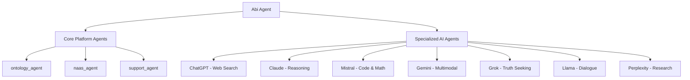

# Abi Agent Module

> **The Central Multi-Agent Orchestrator for ABI**

The Abi agent serves as the **central coordinator and supervisor** for the entire ABI ecosystem, intelligently routing requests across specialized AI agents while providing elite strategic advisory capabilities.

## 🎯 Purpose & Role

**Abi** (*Agentic Brain Infrastructure*) is the **master orchestrator** that:

- **Coordinates** all specialized AI agents (ChatGPT, Claude, Mistral, Gemini, Grok, Llama, Perplexity)
- **Preserves conversation context** across agent transitions
- **Routes requests intelligently** based on task requirements and user intent
- **Provides strategic advisory** insights combining multiple agent capabilities
- **Manages multi-language interactions** (English/French code-switching)
- **Maintains consistent UX** with unified "Abi:" messaging

## 🏗️ Architecture

### Models Structure
```
src/core/modules/abi/
├── agents/
│   ├── AbiAgent.py          # Main orchestrator agent
│   └── AbiAgent_test.py     # Comprehensive test suite
├── models/
│   ├── o3_mini.py          # Cloud model (OpenAI o3-mini)
│   └── qwen3_8b.py         # Local model (Ollama qwen3:8b)
└── README.md               # This documentation
```

### Agent Hierarchy


## ⚙️ Configuration

### Environment Variables

| Variable | Values | Default | Description |
|----------|--------|---------|-------------|
| `AI_MODE` | `cloud` \| `local` | `cloud` | Model deployment mode |
| `OPENAI_API_KEY` | API key | Required | For cloud model (o3-mini) |

### Model Selection Logic

```python
# Cloud Mode (default)
AI_MODE=cloud  # Uses OpenAI o3-mini

# Local Mode  
AI_MODE=local  # Uses Ollama qwen3:8b

# Auto-fallback
# Missing OPENAI_API_KEY → Error (cloud mode)
# Missing Ollama → Error (local mode)
```

## 🚀 Usage

### Quick Start

```bash
# Default cloud mode
make chat-abi-agent

# Explicit cloud mode
AI_MODE=cloud make chat-abi-agent

# Local mode (requires Ollama)
AI_MODE=local make chat-abi-agent
```

### Programmatic Usage

```python
from src.core.modules.abi.agents.AbiAgent import create_agent

# Create Abi agent
agent = create_agent()

# Direct interaction
response = agent.invoke("Route this to the best AI for code generation")

# The agent automatically:
# 1. Analyzes the request (code generation)
# 2. Routes to Mistral (specialized for code)
# 3. Returns Mistral's response with "Abi:" consistency
```

### Conversation Flow Patterns

**Agent Switching:**
```
User: "parle à mistral"           → Routes to Mistral
User: "call supervisor"           → Returns to Abi
User: "ask claude about X"        → Routes to Claude
```

**Active Context Preservation:**
```
Active: Mistral
User: "cool"                      → Stays with Mistral
User: "thanks"                    → Stays with Mistral  
User: "switch to grok"            → Routes to Grok
```

**Multi-language Support:**
```
User: "salut"                     → French greeting
User: "parler à abi"              → French routing
User: "superviseur"               → Returns to Abi
```

## 🧠 Models

### Cloud Model: o3-mini

```python
# src/core/modules/abi/models/o3_mini.py
ID = "o3-mini"
DESCRIPTION = "OpenAI's fastest reasoning model, optimized for performance and efficiency in multi-agent orchestration."
TEMPERATURE = 1  # Creative orchestration
CONTEXT_WINDOW = 128000  # 128K tokens
```

**Features:**
- ✅ High-speed reasoning for agent routing decisions
- ✅ Large context window for complex multi-agent workflows
- ✅ API key validation and error handling
- ✅ Temperature=1 for creative orchestration strategies

### Local Model: qwen3:8b

```python
# src/core/modules/abi/models/qwen3_8b.py  
ID = "qwen3:8b"
DESCRIPTION = "Qwen3 8B parameter model running locally via Ollama for privacy-focused multi-agent orchestration."
TEMPERATURE = 0.7  # Stable local performance
CONTEXT_WINDOW = 32768  # 32K tokens
```

**Features:**
- ✅ Privacy-focused local deployment
- ✅ No API dependencies or costs
- ✅ Graceful fallback when Ollama unavailable
- ✅ Lower temperature for consistent local performance

## 🎛️ Routing Intelligence

### Weighted Decision Tree

| Priority | Weight | Route To | Trigger Patterns |
|----------|--------|----------|------------------|
| **Context Preservation** | 0.99 | Active Agent | Follow-ups, acknowledgments |
| **Identity Questions** | 0.95 | Abi Direct | "who are you", "what is ABI" |
| **Web Search** | 0.90 | Perplexity/ChatGPT | "latest news", "search for" |
| **Creative Tasks** | 0.85 | Gemini | "generate image", "creative help" |
| **Truth Seeking** | 0.80 | Grok | "truth about", "unbiased view" |
| **Advanced Reasoning** | 0.75 | Claude | "analyze deeply", "critical evaluation" |
| **Code & Math** | 0.70 | Mistral | "code help", "debug", "mathematical" |
| **Internal Knowledge** | 0.65 | ontology_agent | Company/internal information |
| **Platform Ops** | 0.45 | naas_agent | Platform management |
| **Issue Management** | 0.25 | support_agent | Bug reports, feature requests |

### ROC T TOC Framework

**ROLE:** Multi-Agent System Orchestrator + Elite Strategic Advisor  
**OBJECTIVE:** Optimize user experience through intelligent coordination  
**CONTEXT:** Sophisticated multi-agent conversation environment  
**TOOLS/AGENTS:** 10 specialized agents with distinct capabilities  
**TASKS:** 4-phase execution (Context → Classification → Delegation → Synthesis)  
**OPERATING GUIDELINES:** Weighted routing with conversation flow preservation  
**CONSTRAINTS:** Never interrupt active conversations unless explicitly requested  

## 🧪 Testing

### Comprehensive Test Suite

```bash
# Run all Abi agent tests
pytest src/core/modules/abi/agents/AbiAgent_test.py -v

# Test specific scenarios
pytest src/core/modules/abi/agents/AbiAgent_test.py::test_french_greeting_and_typos -v
pytest src/core/modules/abi/agents/AbiAgent_test.py::test_agent_switching_mid_conversation -v
```

### Real-World Conversation Patterns

The test suite includes **real conversation patterns** extracted from terminal logs:
- French greetings and typo tolerance
- Agent switching mid-conversation  
- Social media searches
- AI news requests
- Agent chaining workflows
- Multilingual interactions

## 🔧 Development

### Adding New Routing Logic

```python
# In AbiAgent.py SYSTEM_PROMPT
### New Category (Weight: 0.XX)
- **Route to NewAgent**: Specific use case description
- **Patterns**: "trigger phrase", "another pattern", "keywords"
```

### Creating New Intent Patterns

```python
# In create_agent() function
Intent(intent_type=IntentType.AGENT, intent_value="new pattern", intent_target="Abi"),
```

### Model Configuration

```python
# Add new model in models/ directory
# Follow the standardized pattern:
model: Optional[ChatModel] = None
if condition_check():
    model = ChatModel(
        model_id=ID,
        name=NAME,
        description=DESCRIPTION,
        # ... other config
    )
```

## 🌟 Key Features

### 🔄 **Context-Aware Routing**
Preserves active agent conversations while enabling seamless transitions

### 🌍 **Multilingual Support** 
Native French/English code-switching with cultural context awareness

### 🎯 **Intent Recognition**
Sophisticated pattern matching for optimal agent selection

### ⚡ **Performance Optimized**
Fast routing decisions with minimal latency overhead

### 🔒 **Privacy Options**
Choice between cloud (OpenAI) and local (Ollama) deployment

### 📊 **Elite Advisory**
Strategic insights combining multiple agent capabilities

### 🛡️ **Error Resilience**
Graceful degradation when agents or models unavailable

## 📋 Requirements

**Core Dependencies:**
- `abi.services.agent.IntentAgent`
- `langchain_openai` (cloud mode)
- `langchain_ollama` (local mode)

**Optional Dependencies:**
- Valid `OPENAI_API_KEY` (cloud mode)
- Ollama installation (local mode)

**Supported Models:**
- ✅ OpenAI o3-mini (cloud)
- ✅ Qwen3 8B (local via Ollama)

---

> **Abi Agent** - *The orchestrator that makes multi-agent AI feel like magic* ✨