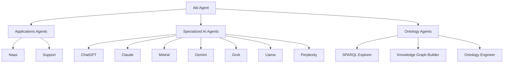

# Abi Agent Module

> **Multi-Agent Orchestrator and Strategic Advisory System**

The Abi agent is the **central coordinator** for the ABI ecosystem, managing specialized AI agents and knowledge graph operations while providing strategic advisory capabilities.

## 🎯 Purpose & Role

**Abi** (*Agentic Brain Infrastructure*) orchestrates multi-agent workflows by:

- **Coordinating** specialized AI agents (ChatGPT, Claude, Mistral, Gemini, Grok, Llama, Perplexity)
- **Managing** conversation context and agent transitions
- **Routing** requests based on weighted decision hierarchy
- **Providing** strategic advisory through direct consultation
- **Supporting** multilingual interactions (English/French)
- **Integrating** knowledge graph exploration and SPARQL querying

## 🏗️ Architecture

### Directory Structure
```
src/core/modules/abi/
├── agents/                  # Agent implementations
│   ├── AbiAgent.py         # Main orchestrator
│   ├── AbiAgent_test.py    # Test suite
│   ├── EntitytoSPARQLAgent.py
│   ├── KnowledgeGraphBuilderAgent.py
│   └── OntologyEngineerAgent.py
├── models/                  # Model configurations
│   ├── o3_mini.py          # OpenAI o3-mini (cloud)
│   └── qwen3_8b.py         # Qwen3 8B (local/Ollama)
├── workflows/               # Business logic workflows
├── pipelines/               # Data processing pipelines
├── ontologies/              # Ontology definitions
├── sandbox/                 # Experimental scripts
├── triggers.py              # Event-driven triggers
├── mappings.py              # Visualization mappings
└── __init__.py              # Module initialization
```

### Agent Ecosystem


## ⚙️ Configuration

### Environment Variables

| Variable | Values | Default | Description |
|----------|--------|---------|-------------|
| `AI_MODE` | `cloud` \| `local` | `cloud` | Model deployment mode |
| `OPENAI_API_KEY` | API key | Required | For cloud model (o3-mini) |
| `NAAS_API_KEY` | API key | Optional | For production ontology triggers |

### Model Selection

The agent automatically selects models based on `AI_MODE`:

```python
# Cloud Mode (default)
AI_MODE=cloud  # Uses OpenAI o3-mini with temperature=1.0

# Local Mode  
AI_MODE=local  # Uses Ollama qwen3:8b with temperature=0.7

# Error handling
# Missing OPENAI_API_KEY in cloud mode → Agent creation fails
# Missing Ollama in local mode → Agent creation fails
```

## 🚀 Usage

### Command Line Interface

```bash
# Start Abi agent (default target)
make chat-abi-agent

# Explicit cloud mode
AI_MODE=cloud make chat-abi-agent

# Local privacy mode (requires Ollama)
AI_MODE=local make chat-abi-agent

# Alternative generic agent runner
make chat agent=AbiAgent
```

### Programmatic Integration

```python
from src.core.modules.abi.agents.AbiAgent import create_agent

# Create agent with automatic model selection
agent = create_agent()

# Direct interaction
response = agent.invoke("Route this to the best AI for code generation")

# Workflow:
# 1. Context preservation check
# 2. Request classification (code generation)
# 3. Weighted routing to Mistral
# 4. Response synthesis with "Abi:" prefix
```

### Interaction Patterns

**Agent Routing:**
```
User: "ask mistral to help with code"    → Routes to Mistral
User: "call supervisor"                  → Returns to Abi
User: "use claude for analysis"          → Routes to Claude
User: "show knowledge graph"             → Opens KG Explorer
```

**Context Preservation (Priority: 0.99):**
```
Active: Mistral
User: "cool"                             → Stays with Mistral
User: "thanks"                           → Stays with Mistral  
User: "switch to grok"                   → Routes to Grok
```

**Multilingual Support:**
```
User: "salut"                            → French greeting
User: "parler à claude"                  → Routes to Claude (French)
User: "superviseur"                      → Returns to Abi
```

## 🧠 Models

### Cloud Model: o3-mini

**Configuration:**
```python
ID = "o3-mini"
OWNER = "openai"
TEMPERATURE = 1.0          # Creative orchestration
CONTEXT_WINDOW = 128000    # 128K tokens
```

**Capabilities:**
- High-speed reasoning for routing decisions
- Large context window for complex workflows
- Creative orchestration (temperature=1.0)
- Requires `OPENAI_API_KEY`

### Local Model: qwen3:8b

**Configuration:**
```python
ID = "qwen3:8b"
OWNER = "alibaba"
TEMPERATURE = 0.7          # Stable performance
CONTEXT_WINDOW = 32768     # 32K tokens
```

**Capabilities:**
- Privacy-focused local deployment
- No API costs or external dependencies
- Multilingual support (Chinese/English)
- Requires Ollama installation

## 🎛️ Routing Intelligence

### Decision Hierarchy (Weighted)

| Priority | Weight | Target | Trigger Patterns |
|----------|--------|--------|------------------|
| **Context Preservation** | 0.99 | Active Agent | Follow-ups, acknowledgments |
| **Identity/Strategic** | 0.95 | Abi Direct | "who are you", strategic consulting |
| **Web Search** | 0.90 | Perplexity/ChatGPT | "latest news", "search for" |
| **Creative/Multimodal** | 0.85 | Gemini | "generate image", "creative help" |
| **Truth Seeking** | 0.80 | Grok | "truth about", "unbiased view" |
| **Advanced Reasoning** | 0.75 | Claude | "analyze deeply", "critical thinking" |
| **Code & Math** | 0.70 | Mistral | "code help", "debug", "mathematical" |
| **Knowledge Graph** | 0.68 | KG Explorer | "show data", "sparql query", "voir ton kg" |
| **Internal Knowledge** | 0.65 | ontology_agent | Organizational information |
| **Platform Operations** | 0.45 | naas_agent | Platform management |
| **Issue Management** | 0.25 | support_agent | Bug reports, feature requests |

### Execution Framework

**4-Phase Process:**

1. **Context Preservation** - Check for active agent conversations
2. **Request Classification** - Analyze intent and requirements  
3. **Intelligent Delegation** - Route via weighted decision tree
4. **Response Synthesis** - Integrate and enhance outputs

**Core Principles:**
- Preserve active conversation context (highest priority)
- Route based on specialized agent capabilities
- Support multilingual interactions seamlessly
- Provide strategic advisory when appropriate

## 🧪 Testing

### Test Suite Execution

```bash
# Run all ABI module tests
pytest src/core/modules/abi/ -v

# Specific agent tests
pytest src/core/modules/abi/agents/AbiAgent_test.py -v

# Individual test scenarios
pytest src/core/modules/abi/agents/AbiAgent_test.py::test_french_greeting_and_typos -v
```

### Coverage Areas

**Conversation Patterns:**
- Multilingual interactions (French/English)
- Agent switching and context preservation
- Real-world conversation flows

**Component Testing:**
- Model configuration validation
- Intent routing logic
- Knowledge graph integration
- Pipeline and workflow functionality

## 🔧 Development

### Module Components

**Agents:** Core orchestrator and specialized knowledge agents
**Models:** Cloud (o3-mini) and local (qwen3:8b) configurations  
**Workflows:** Business logic for agent recommendations and analysis
**Pipelines:** Data processing for ontology management
**Triggers:** Event-driven ontology synchronization (production mode)

### Extension Points

**New Agent Integration:**
1. Add agent reference in `create_agent()`
2. Define intent patterns for routing
3. Update weighted decision hierarchy
4. Add test cases for new routing logic

**Model Addition:**
```python
# models/new_model.py
model: Optional[ChatModel] = None
if condition_check():
    model = ChatModel(model_id=ID, name=NAME, ...)
```

**Workflow Development:**
- Extend `GenericWorkflow` base class
- Implement business logic in workflows/
- Add corresponding test files
- Register in module initialization

## 🌟 Key Features

### 🔄 **Context-Aware Orchestration**
Preserves active conversations while enabling intelligent agent transitions

### 🌍 **Multilingual Support** 
Native French/English code-switching with cultural awareness

### 🎯 **Weighted Decision Routing**
Sophisticated hierarchy for optimal agent selection based on request type

### 🔍 **Knowledge Graph Integration**
Direct access to SPARQL querying and semantic data exploration

### 🔒 **Deployment Flexibility**
Choice between cloud (OpenAI o3-mini) and local (Ollama qwen3:8b) models

### 📊 **Strategic Advisory**
Direct consultation capabilities for business and technical guidance

### 🛡️ **Production Ready**
Event-driven triggers, comprehensive testing, and error resilience

## 📋 Requirements

### Core Dependencies
```python
abi.services.agent.IntentAgent    # Base agent framework
langchain_openai                  # Cloud model support
langchain_ollama                  # Local model support
```

### Environment Setup
```bash
# Cloud mode
OPENAI_API_KEY=your_key_here

# Local mode (requires Ollama)
ollama pull qwen3:8b

# Production triggers (optional)
NAAS_API_KEY=your_key_here
```

### Supported Models
- **OpenAI o3-mini** - Cloud deployment with 128K context
- **Qwen3 8B** - Local deployment via Ollama with 32K context

---

*Multi-agent orchestration with knowledge graph integration and strategic advisory capabilities*