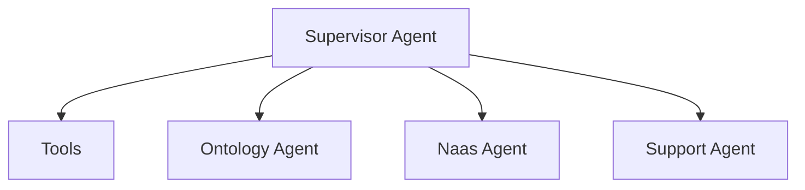

# Supervisor Module

## Description

The Supervisor Module provides the central orchestration and coordination system for the ABI platform. It serves as the primary AI agent that manages task delegation, information synthesis, and strategic decision-making across specialized domains.

Key Features:
- Central agent coordination and task delegation
- Strategic advisory and consulting capabilities
- Memory management and context preservation
- Multi-agent workflow orchestration
- Elite advisory profile for business and technical guidance
- Hierarchical agent routing system

## TL;DR

- Start the Supervisor agent (default):
```bash
make chat-supervisor-agent
```
- Or use the generic chat command:
```bash
make chat Agent=SupervisorAgent
```

## Overview

### Structure

```
src/core/modules/supervisor/
├── agents/                                        # AI agents
│   ├── SupervisorAgent.py                        # Main supervisor orchestrator agent
│   └── SupervisorAgent_test.py                   # Agent tests
└── README.md                                      # This documentation
```

### Core Components

- **SupervisorAgent**: Central AI orchestrator for coordinating specialized agents and providing strategic advisory services

## Agents

### Supervisor Agent

The primary AI agent that serves as the central command center for the ABI system:

1. **Task Delegation**: Routes requests to appropriate specialized agents
2. **Strategic Advisory**: Provides elite-level business and technical consulting
3. **Memory Management**: Maintains context and conversation history
4. **Response Synthesis**: Compiles and synthesizes responses from multiple agents
5. **Quality Assurance**: Validates completeness and accuracy of final responses

```python
from src.core.modules.supervisor.agents.SupervisorAgent import create_agent

# Create supervisor agent
agent = create_agent()

# Use agent for orchestration and advisory services
# The agent provides natural language interface to the entire ABI system
```

## Agent Hierarchy

The Supervisor Agent follows a strict hierarchical delegation system:



### Delegation Weights

1. **Weight: 0.95** - Direct Identity Response
   - Self-referential queries about ABI's identity and capabilities
   - Never delegated to other agents

2. **Weight: 0.85** - Strategic Advisory (Direct Response)
   - Business strategy, technical architecture, general consulting
   - Leverages elite advisory expertise directly

3. **Weight: 0.65** - Ontology Agent
   - Organizational structure, employee information, internal policies
   - Specific internal knowledge queries only

4. **Weight: 0.45** - Naas Agent
   - Platform operations (Plugins, Ontologies, Secrets, Workspace, Users)
   - Platform-specific management tasks

5. **Weight: 0.25** - Support Agent
   - Issue management, feature requests, bug reports
   - Last resort for unhandled requests

## Usage Examples

### Supervisor Agent Interaction

```bash
# Start Supervisor agent (default)
make chat-supervisor-agent

# Example conversations:
# "Who are you and what can you do?"
# "Help me develop a business strategy for my startup"
# "What's the organizational structure of our company?"
# "Create a new plugin for the Naas platform"
# "Report a bug in the authentication system"
```

### Strategic Advisory

The Supervisor Agent provides elite-level strategic advisory services:

- **Business Strategy**: Market analysis, competitive positioning, growth frameworks
- **Technical Architecture**: System design, technology selection, scalability planning
- **Content Strategy**: Media planning, messaging frameworks, audience targeting
- **Performance Optimization**: Process improvement, efficiency frameworks, bottleneck identification

### Agent Coordination

The Supervisor Agent orchestrates complex multi-agent workflows:

1. **Request Analysis**: Determines optimal agent delegation strategy
2. **Parallel Processing**: Coordinates multiple agents for complex tasks
3. **Response Synthesis**: Combines and validates responses from specialized agents
4. **Quality Control**: Ensures completeness and accuracy of final outputs

## Configuration

### Environment Variables

Required environment variables:

```bash
# OpenAI API key for the agent
OPENAI_API_KEY=your_openai_api_key

# Log level for agent operations
LOG_LEVEL=CRITICAL
```

### Agent Configuration

The Supervisor Agent uses the following default configuration:

- **Model**: `o3-mini` (OpenAI)
- **Temperature**: `1` (balanced creativity and consistency)
- **Memory**: Persistent conversation memory
- **Avatar**: ABI branding image

## Operating Guidelines

### Communication Standards

- **Proactive Search**: Always search first with available information
- **Language Matching**: Respond in the same language as the user's request
- **Link Formatting**: Use markdown format for links and images
- **Clarification**: Ask for clarification only when absolutely necessary

### Identity and Branding

- **Always identify as**: Abi, the AI Super Assistant developed by NaasAI
- **Mission alignment**: Support NaasAI's vision of sovereign AI systems
- **No competitor mentions**: Never mention other AI providers
- **Elite standards**: Maintain high-quality, results-driven interactions

## Error Handling

The module provides comprehensive error handling:

1. **Delegation Errors**: Graceful fallback when agent delegation fails
2. **Memory Errors**: Robust memory management with fallback options
3. **Validation Errors**: Input parameter validation before processing
4. **Synthesis Errors**: Quality assurance for multi-agent responses
5. **Communication Errors**: Clear error messages and recovery suggestions

## Troubleshooting

### Common Issues

1. **Agent Not Responding**: Verify OPENAI_API_KEY is set correctly
2. **Delegation Failures**: Check specialized agent availability and configuration
3. **Memory Issues**: Ensure proper memory initialization and persistence
4. **Response Quality**: Validate agent hierarchy and delegation weights
5. **Performance Issues**: Monitor agent response times and optimize routing

## Dependencies

### Core Dependencies
- **abi**: Core ABI framework
- **langchain-openai**: OpenAI integration for agent functionality
- **fastapi**: API router functionality
- **pydantic**: Data validation and serialization

### Optional Dependencies
- **enum**: Enumeration support for configuration
- **importlib**: Dynamic module loading
