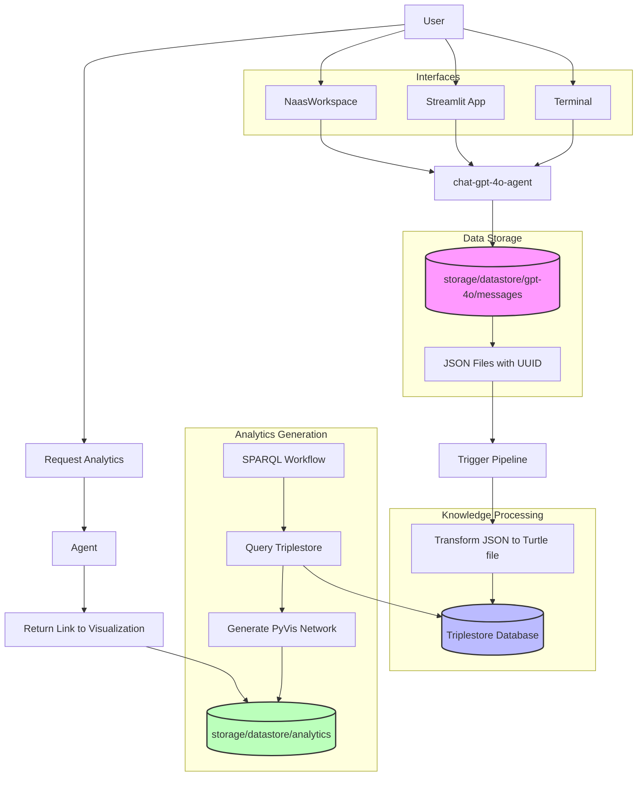

# GPT-4o Module

This module provides integration with OpenAI's GPT-4o model, allowing the ABI system to leverage its advanced multimodal capabilities for various tasks. GPT-4o is OpenAI's most advanced model that combines high performance with cost efficiency.

## Diagram 



## Components

- **Integration**: Provides direct access to GPT-4o via OpenAI's API
- **Model Configuration**: Sets up the GPT-4o model for use within the ABI framework
- **Tools**: Pre-configured tools for common GPT-4o operations
- **Data Storage**: Stores conversation history and manages document uploads/downloads
- **Streamlit App**: Provides a standalone interface for interacting with GPT-4o
- **Analytics Engine**: Analyzes conversation topics and usage patterns
- **Ontologies**: Contains semantic models and knowledge structures used by the module

## Module Structure

The module has the following directory structure:

```
src/custom/modules/gpt-4o/
├── apps/             # Standalone Streamlit application
├── analytics/        # Analysis tools for conversation data
├── ontologies/       # BFO-compliant semantic models
└── ...               # Other module components
```

## Configuration

To use this module, ensure you have set the following in your `.env` file:

```
OPENAI_API_KEY=your_api_key_here
```

## Usage

Once the module is loaded, the GPT-4o model and its integration will be available to other modules and agents in the system.

## Data Storage Structure

The module creates and manages the following directory structure:

```
/storage/datastore/
├── gpt4-o/
│   ├── messages/     # JSON objects of all conversations
│   ├── uploads/      # Storage for ingested documents
│   └── downloads/    # AI-generated documents and files
```

All conversations with the GPT-4o model are automatically stored as JSON objects in the `/storage/datastore/gpt4-o/messages` directory. This enables conversation history tracking and analytics.

### Ontology Processing Pipeline

The module implements an automated pipeline that analyzes messages stored in `/storage/datastore/gpt4-o/messages` and updates BFO-compliant (Basic Formal Ontology) semantic models in the module's `/ontologies` directory. This process structures conversational knowledge into standardized ontological categories:

- **WHAT / WHO → Material Entities**  
  Physical continuants that can be referenced—objects, people, systems, devices.

- **HOW-IT-IS → Qualities**  
  Properties that characterize entities—measurements, states, attributes, version numbers.

- **WHY-(POTENTIAL) → Realizable Entities**  
  Capabilities, roles, functions, or purposes that may be actualized.

- **HOW-IT-HAPPENS → Processes**  
  Events, activities, or transformations that realize potential capabilities.

- **WHEN → Temporal Regions**  
  Timestamps, durations, intervals, or temporal sequences.

- **WHERE → Spatial Regions**  
  Locations, coordinates, environments, or spatial domains.

- **HOW-WE-KNOW / EVIDENCE → Information-Content Entities**  
  Records, descriptions, specifications, or communications that document knowledge.

This standardized ontological framework enables sophisticated knowledge management, contextual understanding, and semantic reasoning across the system.

## Document Management

The module supports document ingestion and generation capabilities:

- **Document Ingestion**: Upload and process documents through the module's interface. All ingested documents are stored in `/storage/datastore/gpt4-o/uploads`.
- **Document Generation**: AI-generated documents are stored in `/storage/datastore/gpt4-o/downloads` for easy access and management.

## Streamlit Application

The module includes a standalone Streamlit application in the `/apps` directory. This provides a user-friendly interface for:

- Direct interaction with GPT-4o
- Document upload and processing
- Viewing and downloading AI-generated content
- Accessing conversation history

To run the Streamlit app:

```
cd src/custom/modules/gpt-4o/apps
streamlit run app.py
```

## Analytics

The module includes analytics capabilities for analyzing conversation data in the `/storage/datastore/gpt4-o/messages` directory. The analytics engine can:

- Identify common topics and themes in conversations
- Track model usage and performance metrics
- Generate insights on user interaction patterns
- Produce reports on conversation trends over time 