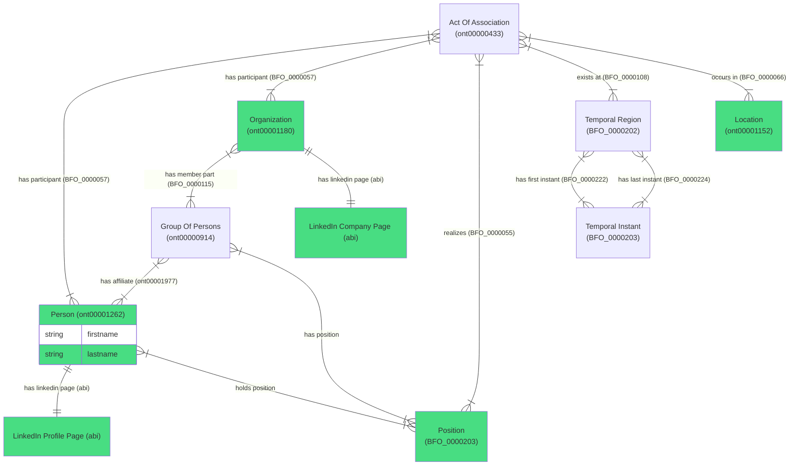

# LindedIn export ontology schema

## Schema Description

This Mermaid Entity-Relationship Diagram represents the ontology schema for LinkedIn export data, showing how different entities (incl. location) relate to each other in the system.

### Core Entities

1. **Person (ont00001262)**
   - Represents an individual with basic attributes like firstname and lastname
   - Links to their LinkedIn profile page

2. **Organization (ont00001180)**
   - Represents a company or institution
   - Has a LinkedIn company page
   - Contains groups of persons as member parts

3. **Position (BFO_0000203)**
   - Represents a role or position that can be held by a person
   - Connected to both persons and groups

4. **Group Of Persons (ont00000914)**
   - Represents teams or departments within organizations
   - Has affiliates (persons) and positions

### Supporting Entities

5. **Act Of Association (ont00000433)**
   - Represents the relationship between a person and an organization
   - Includes temporal and location information
   - Links participants (person, organization) with positions

6. **Temporal Entities**
   - **Temporal Region (BFO_0000202)**: Represents a time period
   - **Temporal Instant (BFO_0000203)**: Represents specific points in time
   - Used to track when associations begin and end

7. **Location (ont00001152)**
   - Represents physical locations where associations occur

8. **LinkedIn-specific Entities**
   - **LinkedIn Profile Page**: Digital representation of a person's professional profile
   - **LinkedIn Company Page**: Digital representation of an organization's profile

### Key Relationships

- Organizations have member parts (Groups of Persons)
- Groups have affiliates (Persons) and positions
- Persons hold positions
- Acts of Association connect persons, organizations, positions, and include temporal and location data
- Temporal Regions have first and last instants

Note: Green-filled entities (Person, Organization, LinkedIn pages, Location, Position) represent primary entities in the system.

